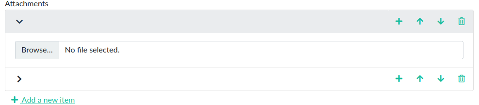
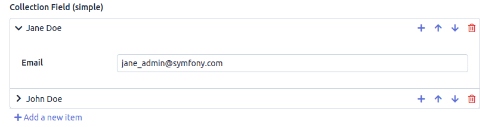

# UX Collection JS  [![Build Status][actions_badge]][actions_link] [![Coverage Status][coveralls_badge]][coveralls_link]

UX collection JS is a Symfony bundle providing Symfony UX integration for collection form type with the help from [Symfony Collection JS](https://github.com/ruano-a/symfonyCollectionJs) library.

## Screenshots




## Installation

UX Collection JS requires PHP 7.4+ and Symfony 4.4+.

Install this bundle using Composer and Symfony Flex:

```sh
composer require tienvx/ux-collection-js:^1.0@beta

# Don't forget to install the JavaScript dependencies as well and compile
yarn add --dev '@symfony/stimulus-bridge@^2.0.0'
yarn install --force
yarn encore dev
```

## Usage

### Symfony

Use the new CollectionType class defined by this bundle:

```php
// ...
use Tienvx\UX\CollectionJs\Form\CollectionJsType;

class PostType extends AbstractType
{
    public function buildForm(FormBuilderInterface $builder, array $options)
    {
        $builder
            // ...
            ->add('authors', CollectionJsType::class, [
                'entry_type' => TextType::class,
                'prototype' => true,
                'allow_add' => true,
                'allow_delete' => true,
                'allow_move_up' => true,
                'allow_move_down' => true,
                'call_post_add_on_init' => true,
            ])
            // ...
        ;
    }

    // ...
}
```

Then you need to set the form theme:
```yaml
# config/packages/twig.yaml
twig:
    form_themes:
      - '@CollectionJs/bootstrap_5_layout.html.twig'
```

Available themes:
- @CollectionJs/bootstrap_5_layout.html.twig
- @CollectionJs/bootstrap_4_layout.html.twig
- @CollectionJs/bootstrap_3_layout.html.twig

### Easyadmin

Create webpack entry:

```javascript
// webpack.config.js
.addEntry('stimulus', './assets/stimulus.js')
```

Then create that javascript file:

```javascript
// assets/stimulus.js

// start the Stimulus application
import './bootstrap';
```

Use the new collection type in the easyadmin controller:

```php
namespace App\Controller\EasyAdmin;

use Tienvx\UX\CollectionJs\Form\CollectionJsType;

class FormFieldReferenceController extends AbstractCrudController
{
    public function configureCrud(Crud $crud): Crud
    {
        return $crud
            // ...
            ->setFormThemes(['@EasyAdmin/crud/form_theme.html.twig', '@CollectionJs/bootstrap_5_layout.html.twig']);
    }

    public function configureFields(string $pageName): iterable
    {
        yield CollectionField::new('collectionSimple', 'Collection Field (simple)')
                ->setFormType(CollectionJsType::class)
                ->setFormTypeOptions([
                    'entry_type' => CollectionSimpleType::class,
                    'allow_add' => true,
                    'allow_delete' => true,
                    'allow_move_up' => true,
                    'allow_move_down' => true,
                    'call_post_add_on_init' => true,
                ])
                ->addWebpackEncoreEntries('stimulus');
    }
}
```

## Contributing
Pull requests are welcome. For major changes, please open an issue first to discuss what you would like to change.

Please make sure to update tests as appropriate.

## License
[MIT](LICENSE)

[actions_badge]: https://github.com/tienvx/ux-collection-js/workflows/main/badge.svg
[actions_link]: https://github.com/tienvx/ux-collection-js/actions

[coveralls_badge]: https://coveralls.io/repos/tienvx/ux-collection-js/badge.svg?branch=main&service=github
[coveralls_link]: https://coveralls.io/github/tienvx/ux-collection-js?branch=main
